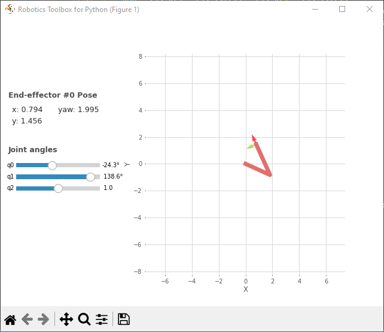

# Robótica AB1_Parte 2: Cinemática Direta

## 1 Questão

### Modelagem do Manipulador RR Planar

```
Rob = ET2.R() * ET2.tx(L1) * ET2.R() * ET2.tx(L2)
```

Nesta questão, modelamos um manipulador RR Planar utilizando a biblioteca RoboticsToolBox do Peter Corke. O manipulador possui dois elos ligados por uma junta do tipo Revolução. As variáveis L1 e L2 representam as distâncias da junta 1 até a junta 2 e da junta 2 até o Efetuador, respectivamente. Os ângulos das juntas são denotados por $\theta_1$ e $\theta_2$. A cinemática inversa é calculada para encontrar os ângulos em radianos que posicionam o efetuador no ponto P = [0.5, 0.5]^T usando as seguintes equações:

```
B = m.acos((x**2 + y**2 - L1**2 - L2**2) / (2 * L1 * L2))
A = m.atan2(y, x) - m.atan2(L2 * m.sin(B), L1 + L2 * m.cos(B))
print(A, B)
```

**Saída:**

```
-0.4240310394907405 2.4188584057763776
```

Matriz de Transformação e Pose do Efetuador
A matriz de transformação da Base para o Efetuador é calculada como:

```
print(f"Fkine =\n{Rob.fkine(q=[A, B])}")
```

**Saída:**

```
Fkine =
  -0.4114   -0.9114    0.5     
   0.9114   -0.4114    0.5     
   0         0         1
```
Podemos interagir com o braço robótico criado usando a função teach(q), onde q é um array contendo os ângulos das juntas.

```
Rob.teach(q=[A, B])
```

<p align="center">
  <a name="figura-1"></a>
  
</p>

### Letra A
```
print(f"Fkine =\n{Rob.fkine(q=[-0.4240, 2.4188])}")
Rob.teach(q=[-0.4240, 2.4188])
print(Rob.fkine(q=[-0.4240, 2.4188]).printline())
```

**Saída:**

```
Fkine =
  -0.4114   -0.9114    0.5     
   0.9114   -0.4114    0.5     
   0         0         1       

t = 0.5, 0.5; 114°
```
```
print(f"Fkine =\n{Rob.fkine(q=[1.9948, -2.4188])}")
Rob.teach(q=[1.9948, -2.4188])
print(Rob.fkine(q=[1.9948, -2.4188]).printline())

```
**Saída:**
```
Fkine =
   0.9115    0.4114    0.5     
  -0.4114    0.9115    0.5     
   0         0         1

t = -0.85, 0.0128; -116°
```

<div style="display: flex;">
  <a name="figura-2"></a>
  
  <a name="figura-3"></a>
  
</div>

Podemos ver que em ambos os casos, quando partimos dos conjuntos de ângulos q+ e q-, o efetuador leva à mesma pose. Isso ocorre porque Fkine não é bijetiva, ou seja, mais de um conjunto de q pode levar ao mesmo ponto, como visto nas imagens [q+](#figura-2) e [q-](#figura-3), que estão no ponto (0.5, 0.5) no plano.

### Letra B
Modificando nosso braço para L1 = 2 e L2 = 1.5 e adicionando uma junta prismática de comprimento de 0 a 2, temos:

```
L1 = 2
L2 = 1.5
Rob = ET2.R() * ET2.tx(L1) * ET2.R() * ET2.tx(L2) * ET2.tx(qlim=[0, 2])
Rob.teach(q=[A, B, 1])
Rob.teach(q=[0, B, 2])
```

<div style="display: flex;">
  <a name="figura-4"></a>
  
  <a name="figura-5"></a>
  
</div>

### Letra C
Com auxílio da função Fkine e Fkine().printline(), podemos calcular a transformação da base para o efetuador e a pose do braço passando os ângulos/distâncias de cada junta.

```
q = [0, 0.5, 0.5]
print(Rob.fkine(q))
```

**Saída:**
```
Fkine =
   0.8776   -0.4794    3.755   
   0.4794    0.8776    0.9589  
   0         0         1
```
```
print(Rob.fkine(q).printline())
```
**Saída:**

```
t = 3.76, 0.959; 28.6°
```
```
Rob.teach(q)
```
<p align="center">
  <a name="figura-6"></a>
  
</p>
## 2 Questão
### Letra A

## 3 Questão
