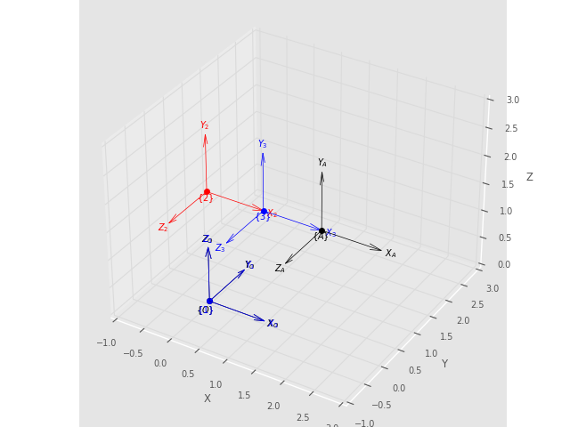
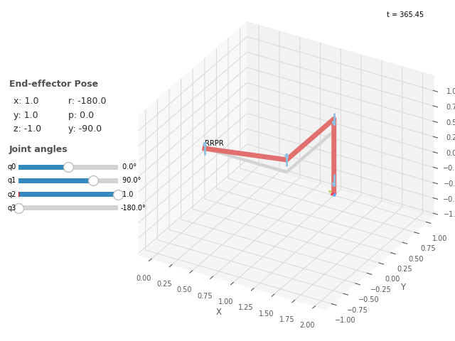

# Robótica AB1_Parte 2: Cinemática Direta

Importando as bibliotecas:

```
import math as m
import numpy as np
from roboticstoolbox import ET2, DHRobot, RevoluteDH, PrismaticDH
import matplotlib.pyplot as plt
from spatialmath.base import *
```

## 1 Questão

### Modelagem do Manipulador RR Planar

```
Rob = ET2.R() * ET2.tx(L1) * ET2.R() * ET2.tx(L2)
```

Nesta questão, modelamos um manipulador RR Planar utilizando a biblioteca RoboticsToolBox do Peter Corke. O manipulador possui dois elos ligados por uma junta do tipo Revolução. As variáveis L1 e L2 representam as distâncias da junta 1 até a junta 2 e da junta 2 até o Efetuador, respectivamente. Os ângulos das juntas são denotados por $\theta_1$ e $\theta_2$. A cinemática inversa é calculada para encontrar os ângulos em radianos que posicionam o efetuador no ponto P = [0.5, 0.5]^T usando as seguintes equações:

```
B = m.acos((x**2 + y**2 - L1**2 - L2**2) / (2 * L1 * L2))
A = m.atan2(y, x) - m.atan2(L2 * m.sin(B), L1 + L2 * m.cos(B))
print(A, B)
```

**Saída:**

```
-0.4240310394907405 2.4188584057763776
```

Matriz de Transformação e Pose do Efetuador
A matriz de transformação da Base para o Efetuador é calculada como:

```
print(f"Fkine =\n{Rob.fkine(q=[A, B])}")
```

**Saída:**

```
Fkine =
  -0.4114   -0.9114    0.5     
   0.9114   -0.4114    0.5     
   0         0         1
```
Podemos interagir com o braço robótico criado usando a função teach(q), onde q é um array contendo os ângulos das juntas.

```
Rob.teach(q=[A, B])
```

<p align="center">
  <a name="figura-1"></a>
  
</p>

### Letra A
```
print(f"Fkine =\n{Rob.fkine(q=[-0.4240, 2.4188])}")
Rob.teach(q=[-0.4240, 2.4188])
print(Rob.fkine(q=[-0.4240, 2.4188]).printline())
```

**Saída:**

```
Fkine =
  -0.4114   -0.9114    0.5     
   0.9114   -0.4114    0.5     
   0         0         1       

t = 0.5, 0.5; 114°
```
```
print(f"Fkine =\n{Rob.fkine(q=[1.9948, -2.4188])}")
Rob.teach(q=[1.9948, -2.4188])
print(Rob.fkine(q=[1.9948, -2.4188]).printline())

```
**Saída:**
```
Fkine =
   0.9115    0.4114    0.5     
  -0.4114    0.9115    0.5     
   0         0         1

t = -0.85, 0.0128; -116°
```

<div style="display: flex;">
  <a name="figura-2"></a>
  
  <a name="figura-3"></a>
  
</div>

Podemos ver que em ambos os casos, quando partimos dos conjuntos de ângulos q+ e q-, o efetuador leva à mesma pose. Isso ocorre porque Fkine não é bijetiva, ou seja, mais de um conjunto de q pode levar ao mesmo ponto, como visto nas imagens [q+](#figura-2) e [q-](#figura-3), que estão no ponto (0.5, 0.5) no plano.

### Letra B
Modificando nosso braço para L1 = 2 e L2 = 1.5 e adicionando uma junta prismática de comprimento de 0 a 2, temos:

```
L1 = 2
L2 = 1.5
Rob = ET2.R() * ET2.tx(L1) * ET2.R() * ET2.tx(L2) * ET2.tx(qlim=[0, 2])
Rob.teach(q=[A, B, 1])
Rob.teach(q=[0, B, 2])
```

<div style="display: flex;">
  <a name="figura-4"></a>
  
  <a name="figura-5"></a>
  
</div>

### Letra C
Com auxílio da função Fkine e Fkine().printline(), podemos calcular a transformação da base para o efetuador e a pose do braço passando os ângulos/distâncias de cada junta.

```
q = [0, 0.5, 0.5]
print(Rob.fkine(q))
```

**Saída:**
```
Fkine =
   0.8776   -0.4794    3.755   
   0.4794    0.8776    0.9589  
   0         0         1
```
```
print(Rob.fkine(q).printline())
```
**Saída:**

```
t = 3.76, 0.959; 28.6°
```
```
Rob.teach(q)
```
<p align="center">
  <a name="figura-6"></a>
  
</p>

## 2 Questão
### Letra A
Atribuindo o sistema de referência para o manipulador R3 mostrado na figura [Q2A2](#figura-7) abaixo:

<div style="display: flex;">
  <a name="figura-7"></a>
  
  <a name="figura-8"></a>
  
</div>

Onde a junta 2 e 3 estão com seus eixo Z perpendicular ao eixo Z da origem, isto é a juntas estão a 90°. E o eixo X da junta 2 e 3 estão seguindo o eixo do braço e o eixo Y esta para cima.

### Letra B
Desenvolvendo a tabela DH(Denavit-Hartenberg) na qual e formada pela os ângulos, rotação($`\theta_j`$) em x($`alpha_j`$), distâcia em x($`a_j`$) e distância de z($`d_j`$), obetemos a tabela abaixo para manipulador R3:

|  j  | θⱼ  |    dⱼ   |   aⱼ   |   ⍺ⱼ   |
| ----|-----|---------|--------|--------|
|   1 | q1  |  L1+L2  |    0   |  90.0° |
|   2 | q2  |    0    |   L3   |  0.0°  |
|   3 | q3  |    0    |   L4   |  0.0°  |

Sabendo que podemos achar as matrizes transformação $` ^0T_1`$, $` ^1T_2`$, $` ^2T_3`$ e $` ^0T_3`$, pela tabela DH acima aplicando na equação:

$`^jT_{j+1}=\begin{bmatrix}\cos \theta _j&-\sin \theta _j\cos \alpha _j&\sin \theta _j\sin \alpha _j&a_j\cos \theta _j\\
\sin \theta _j&\cos \theta _j\cos \alpha _j&-\cos \theta _j\sin \alpha _j&a_j\sin \theta _j\\
0&\sin \alpha _j&\cos \alpha _j&d_j\\
0&0&0&1\end{bmatrix}`$

Obtendo para um entrada **q = [0,0,0] e L1=L2=L3=L4= 1**: 

$`^0T_1=\begin{bmatrix}\cos \theta _1&-\sin \theta _1\cos \left(90°\right)&\sin \theta _1\sin \left(90°\right)&0\\
\sin \theta _1&\cos \theta _1\cos \left(90°\right)&-\cos \theta _1\sin \left(90°\right)&0\\
0&\sin \left(90°\right)&\cos \left(90°\right)&L1+L2\\
0&0&0&1\end{bmatrix}=\ \begin{bmatrix}\cos \theta _1&0&\sin \theta _1&0\\
\sin \theta _1&0&-\cos \theta _1&0\\
0&1&0&L1+L2\\
0&0&0&1\end{bmatrix}=\begin{bmatrix}1&0&0&0\\
0&0&-1&0\\
0&1&0&2\\
0&0&0&1\end{bmatrix}`$

$`^1T_2=\begin{bmatrix}\cos \theta _2&-\sin \theta _2\cos \left(0°\right)&\sin \theta _2\sin \left(0°\right)&L3\cos \theta _2\\
\sin \theta _2&\cos \theta _2\cos \left(0°\right)&-\cos \theta _2\sin \left(0°\right)&L3\sin \theta _2\\
0&\sin \left(0°\right)&\cos \left(0°\right)&0\\
0&0&0&1\end{bmatrix}=\ \begin{bmatrix}\cos \theta _2&-\sin \theta _2&0&L3\cos \theta _2\\
\sin \theta _2&\cos \theta _2&0&L3\sin \theta _2\\
0&0&1&0\\
0&0&0&1\end{bmatrix}=\begin{bmatrix}1&0&0&1\\
0&1&0&0\\
0&0&1&0\\
0&0&0&1\end{bmatrix}`$

$`^2T_3=\begin{bmatrix}\cos \theta _3&-\sin \theta _3\cos \left(0°\right)&\sin \theta _3\sin \left(0°\right)&L4\cos \theta _3\\
\sin \theta _3&\cos \theta _3\cos \left(0°\right)&-\cos \theta _3\sin \left(0°\right)&L4\sin \theta _3\\
0&\sin \left(0°\right)&\cos \left(0°\right)&0\\
0&0&0&1\end{bmatrix}=\ \begin{bmatrix}\cos \theta _3&-\sin \theta _3&0&L4\cos \theta _3\\
\sin \theta _3&\cos \theta _3&0&L4\sin \theta _3\\
0&0&1&0\\
0&0&0&1\end{bmatrix}=\begin{bmatrix}1&0&0&1\\
0&1&0&0\\
0&0&1&0\\
0&0&0&1\end{bmatrix}`$

$`^0T_3 = ^0T_1 \oplus ^1T_2 \oplus ^2T_3`$

$`^3T_0 = \begin{bmatrix}1&0&0&0\\
0&0&-1&0\\
0&1&0&2\\
0&0&0&1\end{bmatrix} * \begin{bmatrix}1&0&0&1\\
0&1&0&0\\
0&0&1&0\\
0&0&0&1\end{bmatrix} * \begin{bmatrix}1&0&0&1\\
0&1&0&0\\
0&0&1&0\\
0&0&0&1\end{bmatrix} = \begin{bmatrix}1&0&0&2\\
0&0&-1&0\\
0&1&0&2\\
0&0&0&1\end{bmatrix}`$

### Letra C

Modelando o robô atravez do RevoluteDH(), temos:

```
e2 = RevoluteDH(d = L1+L2,alpha = PI/2)
e3 = RevoluteDH(a = L3 )
e4 = RevoluteDH(a = L4)

rob = DHRobot([e2,e3,e4], name = 'RRR')
print(rob)
```
**Saida:**
```
DHRobot: RRR, 3 joints (RRR), dynamics, standard DH parameters
┌────┬────┬────┬───────┐
│θⱼ  │ dⱼ │ aⱼ │  ⍺ⱼ   │
├────┼────┼────┼───────┤
│ q1 │  2 │  0 │ 90.0° │
│ q2 │  0 │  1 │  0.0° │
│ q3 │  0 │  1 │  0.0° │
└────┴────┴────┴───────┘
```
Onde atravez da função fkine_all(), podemos ver a transformações da base até a junta j:
```
T = rob.fkine_all(q=[0,0,0])
print(T)
```
**Saida:**
```
[0] =
   1         0         0         0       
   0         1         0         0       
   0         0         1         0       
   0         0         0         1       
[1] =
   1         0         0         0       
   0         0        -1         0       
   0         1         0         2       
   0         0         0         1       
[2] =
   1         0         0         1       
   0         0        -1         0       
   0         1         0         2       
   0         0         0         1       
[3] =
   1         0         0         2       
   0         0        -1         0       
   0         1         0         2       
   0         0         0         1  

```
Sendo 

$`T[0] = ^0T_0 = \begin{bmatrix}1&0&0&0\\
0&1&0&0\\
0&0&1&0\\
0&0&0&1\end{bmatrix}`$,

$`T[1] = ^0T_1 = \begin{bmatrix}1&0&0&0\\
0&0&-1&0\\
0&1&0&2\\
0&0&0&1\end{bmatrix}`$,

$`T[2]= ^0T2 `$ 
$`^0T2 = ^0T_1 \oplus ^1T_2`$

$`^0T_2 = \begin{bmatrix}1&0&0&0\\
0&0&-1&0\\
0&1&0&2\\
0&0&0&1\end{bmatrix} * \begin{bmatrix}1&0&0&1\\
0&1&0&0\\
0&0&1&0\\
0&0&0&1\end{bmatrix} = \begin{bmatrix}1&0&0&1\\
0&0&-1&0\\
0&1&0&2\\
0&0&0&1\end{bmatrix}`$

e $`T[3]= ^0T3 `$ 
$` ^0T3 = ^0T_1 \oplus ^1T_2 \oplus ^2T_3 `$

$`^0T_3 = \begin{bmatrix}1&0&0&0\\
0&0&-1&0\\
0&1&0&2\\
0&0&0&1\end{bmatrix} * \begin{bmatrix}1&0&0&1\\
0&1&0&0\\
0&0&1&0\\
0&0&0&1\end{bmatrix} * \begin{bmatrix}1&0&0&1\\
0&1&0&0\\
0&0&1&0\\
0&0&0&1\end{bmatrix} = \begin{bmatrix}1&0&0&2\\
0&0&-1&0\\
0&1&0&2\\
0&0&0&1\end{bmatrix}`$

Podendo ver que os resultando batem com o gerados pelo função fkine_all da RoboticsToolBox
```
rob.teach(q = [0,0,0])
rob.teach(q = [0,-PI/4,PI/2])
```
<div style="display: flex;">
  <a name="figura-9"></a>
  
  <a name="figura-10"></a>
  
</div>

## 3 Questão
### Modelando o robô SCARA:

<div style="display: flex;">
  <a name="figura-11"></a>
  
  <a name="figura-12"></a>
  
</div>

Modedelando o robô SCARA da figura acima atravez da juntas e elos, obetmos a tabela DH: 

|  j  | θⱼ  |    dⱼ   |   aⱼ   |   ⍺ⱼ   |
| ----|-----|---------|--------|--------|
|   1 | q1  |   D1    |   L1   |   0.0° |
|   2 | q2  |    0    |   L2   | 180.0° |
|   3 | 0   |   q3    |   0    |  0.0°  |
|   4 | q4  |   D4    |   0    |  0.0°  |

Onde podemos calcular a pose final do robô atraves da matrizes de transformação $`^0T_4`$. Sendo a matriz $`^0T_4 = ^0T_1 \oplus ^1T_2 \oplus ^2T_3 \oplus ^3T_4 `$, para nosso manipulador acima teriamos as matrizes transformação:

```
def Pose(q = [0,0,0,0],L1=1,L2=1,D1=0.2,D3=1,D4=0.2):
    T01 = np.matrix(
        [[m.cos(q[0]),-m.sin(q[0])*m.cos(0),m.sin(q[0])*m.sin(0),L1*m.cos(q[0])],
         [m.sin(q[0]),m.cos(q[0])*m.cos(0),-m.cos(q[0])*m.sin(0),L1*m.sin(q[0])],
         [0,m.sin(0),m.cos(0),D1],
         [0,0,0,1]])
    T12 = np.matrix(
        [[m.cos(q[1]),-m.sin(q[1])*m.cos(PI),m.sin(q[1])*m.sin(PI),L2*m.cos(q[1])],
         [m.sin(q[1]),m.cos(q[1])*m.cos(PI),-m.cos(q[1])*m.sin(0), L2*m.sin(q[1])],
         [0,m.sin(PI),m.cos(PI),0],
         [0,0,0,1]])
    T23 = np.matrix(
        [[m.cos(0),-m.sin(0)*m.cos(0),m.sin(0)*m.sin(0),0],
         [m.sin(0),m.cos(0)*m.cos(0),-m.cos(0)*m.sin(0),0],
         [0,m.sin(0),m.cos(0),q[2]],
         [0,0,0,1]])
    T34 = np.matrix(
        [[m.cos(q[3]),-m.sin(q[3])*m.cos(0),m.sin(q[3])*m.sin(0),0],
         [m.sin(q[3]),m.cos(q[3])*m.cos(0),-m.cos(q[3])*m.sin(0),0],
         [0,m.sin(0),m.cos(0),D4],
         [0,0,0,1]])
    
    T= (np.dot(T01,T12))
    T = np.dot(T,T23)
    T04 = np.around(np.dot(T,T34),2)
    print("0T4")
    print(T04)
```
Onde copararemos nossa matriz $`^0T_4`$ com pose gerada por da biblioteca RoboticsToolBox, atraves da função fkine(), sendo assim modelalos o robô:

```
e1 = RevoluteDH(a = L1,d = D1)
e2 = RevoluteDH(a = L2,alpha = PI)
e3 = PrismaticDH(qlim = [0, D3])
e4=  RevoluteDH(d = D4)
rob = DHRobot([e1,e2,e3,e4], name = 'RRPR')
print(rob)
```
**Saida:**
```
 θⱼ  │ dⱼ  │ aⱼ │   ⍺ⱼ   │   q⁻    │   q⁺   │
├─────┼─────┼────┼────────┼─────────┼────────┤
│ q1  │ 0.2 │  1 │   0.0° │ -180.0° │ 180.0° │
│ q2  │   0 │  1 │ 180.0° │ -180.0° │ 180.0° │
│0.0° │  q3 │  0 │   0.0° │     0.0 │    1.0 │
│ q4  │ 0.2 │  0 │   0.0° │ -180.0° │ 180.0°
```
Comparando para os caso abaixos, temos:

```
print("Pose: Implementação da função")
Pose(q, L1, L2, D1, D4)

print("Pose: Fkine")
print(rob.fkine(q))

rob.teach(q)
```
### Caso 1: q = [0,0,0,0] e L1 = 1, L2 = 1, D1 = 0.2, D3 = [0,1] e D4 = 0.2

**Saida:**

```
Pose: Implementação da função
0T4 =
[[ 1.   0.   0.   2. ]
 [ 0.  -1.   0.   0. ]
 [ 0.   0.  -1.  -0.5]
 [ 0.   0.   0.   1. ]]

Pose: Fkine
   1         0         0         2       
   0        -1         0         0       
   0         0        -1        -0.5     
   0         0         0         1
```
<p align="center">
  <a name="figura-13"></a>
  
</p>

### Caso 2: q= [0,-PI/4,0.5,PI/2] e L1 = 1, L2 = 1, D1 = 0.2, D3 = [0,1] e D4 = 0.2

**Saida:**

```
Pose: Implementação da função
0T4 =
[[-0.71 -0.71 -0.    1.71]
 [-0.71  0.71  0.   -0.71]
 [ 0.    0.   -1.   -0.5 ]
 [ 0.    0.    0.    1.  ]]

Pose: Fkine
  -0.7071   -0.7071    0         1.707   
  -0.7071    0.7071    0        -0.7071  
   0         0        -1        -0.5     
   0         0         0         1      
```
<p align="center">
  <a name="figura-13"></a>
  
</p>

### Caso 3: q= [-PI/2,PI/2,0.3,PI] e L1 = 1, L2 = 1, D1 = 0.2, D3 = [0,1] e D4 = 0.2

**Saida:**

```
Pose: Implementação da função
0T4 =
[[-1.  -0.   0.   1. ]
 [-0.   1.  -0.  -1. ]
 [ 0.  -0.  -1.  -0.3]
 [ 0.   0.   0.   1. ]]

Pose: Fkine
  -1         0         0         1       
   0         1         0        -1       
   0         0        -1        -0.3     
   0         0         0         1   
```
<p align="center">
  <a name="figura-13"></a>
  
</p>

### Caso 4: q= q= [0,PI/2,1,-PI] e L1 = 1, L2 = 1, D1 = 0.2, D3 = [0,1] e D4 = 0.2

**Saida:**

```
Pose: Implementação da função
0T4 =
[[-0. -1.  0.  1.]
 [-1.  0.  0.  1.]
 [-0. -0. -1. -1.]
 [ 0.  0.  0.  1.]]

Pose: Fkine
   0        -1         0         1       
  -1         0         0         1       
   0         0        -1        -1       
   0         0         0         1 
```
<p align="center">
  <a name="figura-13"></a>
  
</p>

Podemos ver que para os 4 casos apresentados acima o resultado foi semelhante
